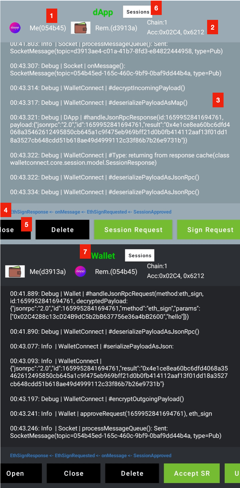
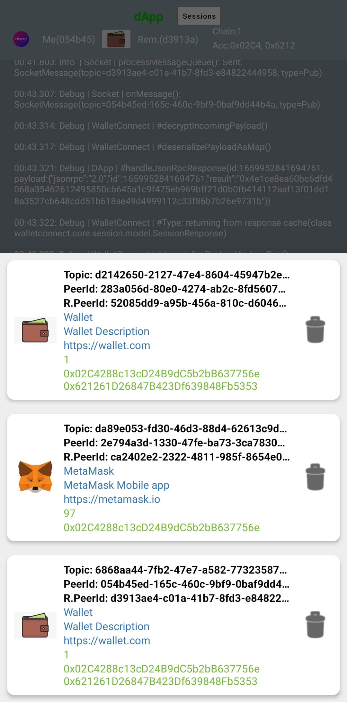

## WalletConnect V1

Implementation of [WalletConnect protocol V1](https://docs.walletconnect.com/tech-spec) in Kotlin.

- Heavily uses Kotlin **Coroutines**.
- **Extendable**, you can provide your own implementation of almost anything
- Can be used in any **Kotlin** or **Android** project. Only Android [sample app](sample) is provided.
- **Warning**: Usage from Java projects is not tested
- **Warning**: APIs are not final yet, breaking changes should be expected

### Install

[](https://jitpack.io/#jemshit/WalletConnect)

**1. DApp & Wallet**

```kotlin
implementation("com.jemshit.walletconnect:walletconnect:x.y.z")
```

You can provide your own implementation of [DApp](walletconnect-core/src/main/java/walletconnect/core/DApp.kt)
and [Wallet](walletconnect-core/src/main/java/walletconnect/core/Wallet.kt)

**2. Socket**

```kotlin
implementation("com.jemshit.walletconnect:walletconnect-socket-scarlet:x.y.z")
```

You can provide your own implementation
of [Socket](walletconnect-core/src/main/java/walletconnect/core/socket/Socket.kt)

**3. Adapter**

```kotlin
implementation("com.jemshit.walletconnect:walletconnect-adapter-gson:x.y.z")
// or
implementation("com.jemshit.walletconnect:walletconnect-adapter-moshi:x.y.z")
```

You can provide your own implementation
of [JsonAdapter](walletconnect-core/src/main/java/walletconnect/core/adapter/JsonAdapter.kt)

**4. Session Store**

```kotlin
implementation("com.jemshit.walletconnect:walletconnect-store-file:x.y.z")
// or (Android only)
implementation("com.jemshit.walletconnect:walletconnect-store-prefs:x.y.z")
```

You can provide your own implementation
of [SessionStore](walletconnect-core/src/main/java/walletconnect/core/session_state/SessionStore.kt)

**5. Other implementations**

- Provide [Logger](walletconnect-core/src/main/java/walletconnect/core/util/Logger.kt)
    - Default
      provided: [ConsoleLogger](walletconnect-core/src/main/java/walletconnect/core/util/logger_impl/ConsoleLogger.kt)
    - Default
      provided: [EmptyLogger](walletconnect-core/src/main/java/walletconnect/core/util/logger_impl/EmptyLogger.kt)
    - Android sample: [AndroidLogger](sample/src/main/java/walletconnect/sample/impl/AndroidLogger.kt)

- Provide [DispatcherProvider](walletconnect-core/src/main/java/walletconnect/core/util/DispatcherProvider.kt)
    - Android
      sample: [AndroidDispatcherProvider](sample/src/main/java/walletconnect/sample/impl/AndroidDispatcherProvider.kt)

### Usage

Make sure to **check Documentation** of Functions & Models. They contain helpful information.

<details>
<summary>Create DApp/Wallet</summary>

```kotlin
fun createDApp(sessionStoreName: String)
        : DApp {
    return DAppManager(
            socketFactory = { url -> createSocket(url) },
            sessionStore = createSessionStore(sessionStoreName),
            jsonAdapter = createJsonAdapter(),
            dispatcherProvider,
            logger
    )
}

fun createWallet(sessionStoreName: String)
        : Wallet {
    return WalletManager(
            socketFactory = { url -> createSocket(url) },
            sessionStore = createSessionStore(sessionStoreName),
            jsonAdapter = createJsonAdapter(),
            dispatcherProvider,
            logger
    )
}

fun createSocketService(url: String,
                        lifecycleRegistry: LifecycleRegistry)
        : SocketService {

    // you can ignore this
    val interceptor = HttpLoggingInterceptor().apply {
        level = HttpLoggingInterceptor.Level.HEADERS
    }

    // change depending on your needs
    val okHttpClient = OkHttpClient.Builder()
            .callTimeout(10, TimeUnit.SECONDS)
            .readTimeout(10, TimeUnit.SECONDS)
            .writeTimeout(10, TimeUnit.SECONDS)
            // "https://bridge.walletconnect.org" -> i think BridgeServer responds with "missing or invalid socket data"
            // "https://safe-walletconnect.gnosis.io" -> ping works fine
            .pingInterval(4, TimeUnit.SECONDS)
            .addNetworkInterceptor(interceptor)
            .build()

    val webSocketFactory = okHttpClient.newWebSocketFactory(url)

    // you can use something else instead of Gson, make sure to provide SocketMessageTypeAdapter() & JsonRpcMethodTypeAdapter()
    val gson = GsonBuilder()
            .registerTypeAdapter(SocketMessageType::class.java, SocketMessageTypeAdapter())
            .registerTypeAdapter(JsonRpcMethod::class.java, JsonRpcMethodTypeAdapter())
            .create()

    val scarlet = Scarlet.Builder()
            .webSocketFactory(webSocketFactory)
            .addMessageAdapterFactory(GsonMessageAdapter.Factory(gson))
            .addStreamAdapterFactory(FlowStreamAdapter.Factory)
            .backoffStrategy(ExponentialBackoffStrategy(initialDurationMillis = 1_000L,
                                                        maxDurationMillis = 8_000L))
            .lifecycle(lifecycleRegistry)
            .build()

    return scarlet.create(SocketService::class.java)
}

fun createSocket(url: String)
        : Socket {
    val gson = GsonBuilder()
            .registerTypeAdapter(SocketMessageType::class.java, SocketMessageTypeAdapter())
            .registerTypeAdapter(JsonRpcMethod::class.java, JsonRpcMethodTypeAdapter())
            .create()

    return SocketManager(
            socketServiceFactory = { lifecycleRegistry -> createSocketService(url, lifecycleRegistry) },
            gson,
            dispatcherProvider,
            logger
    )
}

fun createSessionStore(name: String)
        : SessionStore {

    // return anything that implements SessionStore

    //val sharedPrefs = requireContext().applicationContext.getSharedPreferences(name, Context.MODE_PRIVATE)
    //return SharedPrefsSessionStore(
    //        sharedPrefs,
    //        dispatcherProvider,
    //        logger
    //)

    return FileSessionStore(
            File(requireContext().filesDir, "$name.json"),
            dispatcherProvider,
            logger
    )
}

fun createJsonAdapter()
        : JsonAdapter {

    // return anything that implements JsonAdapter. Make sure to provide SocketMessageTypeAdapter() & JsonRpcMethodTypeAdapter()

    //val gson = GsonBuilder()
    //        .registerTypeAdapter(SocketMessageType::class.java, SocketMessageTypeAdapter())
    //        .registerTypeAdapter(JsonRpcMethod::class.java, JsonRpcMethodTypeAdapter())
    //        .serializeNulls()
    //        .create()
    //
    //return GsonAdapter(gson)


    val moshi = Moshi.Builder()
            .add(walletconnect.adapter.moshi.type_adapter.SocketMessageTypeAdapter())
            .add(walletconnect.adapter.moshi.type_adapter.JsonRpcMethodTypeAdapter())
            .addLast(KotlinJsonAdapterFactory())
            .build()
    return MoshiAdapter(moshi)
}
```

</details>

<details>
<summary>DApp</summary>

```kotlin
// Init
val connectionParams = ConnectionParams(
        topic = UUID.randomUUID().toString(), // unique topic = unique session
        version = "1",
        // "https://bridge.walletconnect.org" -> when one peer deletes session while other peer is disconnected, 
        //     other peer never gets that message even after connecting. Also pings in socket is not supported
        bridgeUrl = "https://safe-walletconnect.gnosis.io",
        symmetricKey = "..." // 32 byte (64 char) encryption/decryption key
)

val initialSessionState = InitialSessionState(
        connectionParams,
        myPeerId = UUID.randomUUID().toString(),
        myPeerMeta = PeerMeta(
                name = "DApp",
                url = "https://dapp.com",
                description = "DApp Description",
                icons = listOf("https://www.dapp.com/img/Icon_Logotype_2.png")
        )
)

val dApp: DApp = createDApp(sessionStoreName = "...")

// Open Socket
coroutineScope.launch(dispatcherProvider.io()) {
    // openSocket has blocking calls inside, running outside UI thread might be good idea
    dApp.openSocket(initialSessionState, callback = ::onSessionCallback)
}

// Close Socket
dApp.close(deleteLocal = false, deleteRemote = false)

// Close & Delete Session
dApp.close(deleteLocal = true, deleteRemote = true)

// Session Request
dApp.sendSessionRequest(chainId)

// Sign Request
coroutineScope.launch(dispatcherProvidedr.io()) {
    val ethSign = EthSign(address = "...",
                          message = "...", // raw string for SignType.Sign, hex string for SignType.PersonalSign
                          type = SignType.Sign) // SignType.PersonalSign
    // ethSign.validate()

    val messageId: Long? = dApp.sendRequest(
            method = ethSign.type.toMethod(),
            data = ethSign.toList(),
            itemType = String::class.java
    )
    // You can store Map<messageId, MyCallback>, so when you get response for this messageId in 'onSessionCallback', 
    //  you can invoke corresponding MyCallback
}

// EthSendTransaction Request
// Check sample for sending custom token using SmartContract address. 
// There is also gas estimation API example for Binance Smart Chain
// Check HexByteExtensions.kt for 'toHex' extension on String/Long/Int
fun createTransaction()
        : EthTransaction {
    return EthTransaction(
            from = approvedAddress,
            to = "0x621261D26847B423Df639848Fb53530025a008e8",
            data = "",
            chainId = approvedChainId.toHex(),

            gas = null,
            gasPrice = null,
            gasLimit = null,
            maxFeePerGas = null,
            maxPriorityFeePerGas = null,

            value = "0x" + BigInteger("10000000000000000").toString(16), // 1_000_000_000_000_000_000L.toHex(),
            nonce = null
    )
}

coroutineScope.launch(dispatcherProvidedr.io()) {
    // you can call EthTransaction.validate() before sending
    val messageId: Long? = dApp.sendRequest(
            EthRpcMethod.SendTransaction,
            data = listOf(createTransaction()),
            itemType = EthTransaction::class.java
    )
    // You can store Map<messageId, MyCallback>, so when you get response for this messageId in 'onSessionCallback', 
    //  you can invoke corresponding MyCallback
}

// Custom Request
// check JsonRpcMethod file for list of default provided
coroutineScope.launch(dispatcherProvidedr.io()) {
    val messageId: Long? = dApp.sendRequest(
            CustomRpcMethod("some_method_name"),
            data = listOf(MyClass()),
            itemType = MyClass::class.java
    )
}

// Custom SocketMessage
// 'dApp.sendRequest' uses 'encryptPayloadAndPublish' under the hood, you can use 'encryptPayloadAndPublish' directly

// Other
// dApp.generateMessageId()
// dApp.getInitialSessionState()   // inherited from SessionLifecycle interface
// dApp.disconnectSocket()         // inherited from SessionLifecycle interface
// dApp.reconnectSocket()          // inherited from SessionLifecycle interface

// Callbacks
fun onSessionCallback(callbackData: CallbackData) {
    coroutineScope.launch(dispatcherProvider.ui()) {
        when (callbackData) {
            is SessionCallback -> {
                when (callbackData) {
                    // ...        
                }
            }
            is SocketCallback -> {
                when (callbackData) {
                    // ...
                }
            }
            is RequestCallback -> {
                when (callbackData) {
                    // ...
                }
            }
            is FailureCallback -> {
                // ...
            }
        }
    }
}

// DeepLink to Wallet app
fun triggerDeepLink() {
    val currentSessionState = dApp.getInitialSessionState() ?: return
    try {
        val myIntent = Intent(Intent.ACTION_VIEW, Uri.parse(currentSessionState.connectionParams.toUri()))
        startActivity(myIntent)
    } catch (_: ActivityNotFoundException) {
        Toast
                .makeText(requireContext(),
                          "No application can handle this request. Please install a wallet app",
                          Toast.LENGTH_LONG)
                .show()
    }
}

```

</details>

<details>
<summary>Wallet</summary>

```kotlin
// Init
val connectionParams: ConnectionParams // get through deeplink, QR code ...

val initialSessionState = InitialSessionState(
        connectionParams,
        myPeerId = UUID.randomUUID().toString(),
        myPeerMeta = PeerMeta(
                name = "Wallet",
                url = "https://wallet.com",
                description = "Wallet Description",
                icons = listOf("https://img.favpng.com/1/20/24/wallet-icon-png-favpng-TQrAD3mHXn7Yey6wnt6aa97YF.jpg")
        )
)

val wallet: Wallet = createWallet(sessionStoreName = "...")

// Open Socket
coroutineScope.launch(dispatcherProvider.io()) {
    // openSocket has blocking calls inside, running outside UI thread might be good idea
    wallet.openSocket(initialSessionState, callback = ::onSessionCallback)
}

// Close Socket
wallet.close(deleteLocal = false, deleteRemote = false)

// Close & Delete Session
wallet.close(deleteLocal = true, deleteRemote = true)

// Approve Session Request
wallet.approveSession(chainId = 1, accounts = listOf("0x621261D26847B423Df639848Fb53530025a008e8"))

// Reject Session Request
wallet.rejectSession()

// Update Session
// if 'approved' is false, close() is called internally. Session is deleted from both peers
wallet.updateSession(chainId = 2,
                     accounts = listOf("0x621261D26847B423Df639848Fb53530025a008e8"),
                     approved = true)

// Approve Request
coroutineScope.launch(dispatcherProvidedr.io()) {
    // respond with same messageId!
    wallet.approveRequest(messageId,
                          result = signature, // or anything else
                          resultType = String::class.java)
}

// Reject Request
coroutineScope.launch(dispatcherProvidedr.io()) {
    wallet.rejectRequest(messageId, JsonRpcErrorData())
}

// Custom SocketMessage
// you can use 'encryptPayloadAndPublish' directly to send custom SocketMessage

// Other
// dApp.generateMessageId()
// dApp.getInitialSessionState()   // inherited from SessionLifecycle interface
// dApp.disconnectSocket()         // inherited from SessionLifecycle interface
// dApp.reconnectSocket()          // inherited from SessionLifecycle interface

// Callbacks
fun onSessionCallback(callbackData: CallbackData) {
    coroutineScope.launch(dispatcherProvider.ui()) {
        when (callbackData) {
            is SessionCallback -> {
                when (callbackData) {
                    // ...        
                }
            }
            is SocketCallback -> {
                when (callbackData) {
                    // ...
                }
            }
            is RequestCallback -> {
                when (callbackData) {
                    // ...
                }
            }
            is FailureCallback -> {
                // ...
            }
        }
    }
}

```

</details>

<details>
<summary>Local Session List</summary>

```kotlin
// obtain same sessionStore used for DApp/Wallet
val sessionStore = return FileSessionStore(
        File(requireContext().filesDir, "$name.json"),
        dispatcherProvider,
        logger
)

// one-time list
coroutineScope.launch(dispatcherProvider.io()) {
    val sessionList: List? = sessionStore.getAll()
}

// list as hot flow
sessionStore.getAllAsFlow()
        .onEach {}
        .catch {}
        .launchIn(coroutineScope)

// Check SessionStore for other methods

```

</details>

### Sample

[Sample Android App](sample)

<p>
  
&nbsp; &nbsp; &nbsp; &nbsp;
  
</p>

Image 1:

1. PeerId & Logo of DApp/Wallet
2. Approved ChainId & Accounts
3. Logs (make sure to press 'Clear' button once a while)
4. Callbacks
5. Action Buttons (can scroll horizontally)
6. Session List (image 2)

Image 2:

- Click to reconnect to any previous Session
- Press delete icon to delete any previous Session

### Changelog & Migration

[CHANGELOG.md](CHANGELOG.md)

### ProGuard (Android)

Example in [sample](sample/proguard-rules.pro)

<details>
<summary>WalletConnect</summary>

```proguard
### WalletConnect
-keepclassmembers class walletconnect.core.requests.eth.** {
    public synthetic <methods>;
    <methods>;
    <fields>;
}
-keepclassmembers class walletconnect.core.session.model.** {
    public synthetic <methods>;
    <methods>;
    <fields>;
}
-keepclassmembers class walletconnect.core.session_state.model.** {
    public synthetic <methods>;
    <methods>;
    <fields>;
}
-keepclassmembers class walletconnect.core.socket.model.** {
    public synthetic <methods>;
    <methods>;
    <fields>;
}
```

</details>

<details>
<summary>Other dependencies</summary>

```proguard
### Kotlin
# https://stackoverflow.com/questions/33547643/how-to-use-kotlin-with-proguard
# https://medium.com/@AthorNZ/kotlin-metadata-jackson-and-proguard-f64f51e5ed32
-keepclassmembers class **$WhenMappings {
    <fields>;
}
-keep class kotlin.Metadata { *; }
-keepclassmembers class kotlin.Metadata {
    public <methods>;
}

### Kotlin Coroutine
# Most of volatile fields are updated with AFU and should not be mangled
# ServiceLoader support
-keepnames class kotlinx.coroutines.internal.MainDispatcherFactory {}
-keepnames class kotlinx.coroutines.CoroutineExceptionHandler {}
-keepnames class kotlinx.coroutines.android.AndroidExceptionPreHandler {}
-keepnames class kotlinx.coroutines.android.AndroidDispatcherFactory {}
# Most of volatile fields are updated with AFU and should not be mangled
-keepclassmembernames class kotlinx.** {
    volatile <fields>;
}
# Same story for the standard library's SafeContinuation that also uses AtomicReferenceFieldUpdater
-keepclassmembernames class kotlin.coroutines.SafeContinuation {
    volatile <fields>;
}
-dontwarn kotlinx.atomicfu.**
-dontwarn kotlinx.coroutines.flow.**

-keep class kotlin.Metadata { *; }
-keepclassmembers class kotlin.Metadata {
    public <methods>;
}

### Gson 
# uses generic type information stored in a class file when working with fields. 
# Proguard removes such information by default, so configure it to keep all of it.
-keepattributes Signature
# For using GSON @Expose annotation
-keepattributes *Annotation*
# Gson specific classes
-dontwarn sun.misc.**
#-keep class com.google.gson.stream.** { *; }
# Application classes that will be serialized/deserialized over Gson
-keep class com.google.gson.examples.android.model.** { <fields>; }
# Prevent proguard from stripping interface information from TypeAdapter, TypeAdapterFactory,
# JsonSerializer, JsonDeserializer instances (so they can be used in @JsonAdapter)
-keep class * extends com.google.gson.TypeAdapter
-keep class * implements com.google.gson.TypeAdapterFactory
-keep class * implements com.google.gson.JsonSerializer
-keep class * implements com.google.gson.JsonDeserializer
# Prevent R8 from leaving Data object members always null
-keepclassmembers,allowobfuscation class * {
  @com.google.gson.annotations.SerializedName <fields>;
}

### JSR305
-dontwarn javax.annotation.**

### OkHttp3
-dontwarn okhttp3.**
-dontwarn okio.**
-dontwarn javax.annotation.**
# A resource is loaded with a relative path so the package of this class must be preserved.
-keepnames class okhttp3.internal.publicsuffix.PublicSuffixDatabase
```

</details>

### Todo

- Java interop. [1](https://kotlinlang.org/docs/java-to-kotlin-interop.html)
  , [2](https://www.baeldung.com/kotlin/jvm-annotations)
- Use sample as wallet, connecting to web dApp
  using [barcode](https://github.com/trustwallet/wallet-connect-kotlin/commit/fbb51e74349634a04e001091ec2db2d6e9a5053d)
- Editable Transaction Screen in sample app
- Unit tests for [DAppManager](walletconnect/src/main/java/walletconnect/DAppManager.kt)
  , [WalletManager](walletconnect/src/main/java/walletconnect/WalletManager.kt)
  , [WalletConnectCore](walletconnect/src/main/java/walletconnect/WalletConnectCore.kt)
- [walletconnect-requests](walletconnect-requests/src/main/java/walletconnect/requests) module for custom
  request/response models
- Maybe `walletconnect-store-room` DB implementation
  of [SessionStore](walletconnect-core/src/main/java/walletconnect/core/session_state/SessionStore.kt)
- Maybe everything could be expressed with state machine